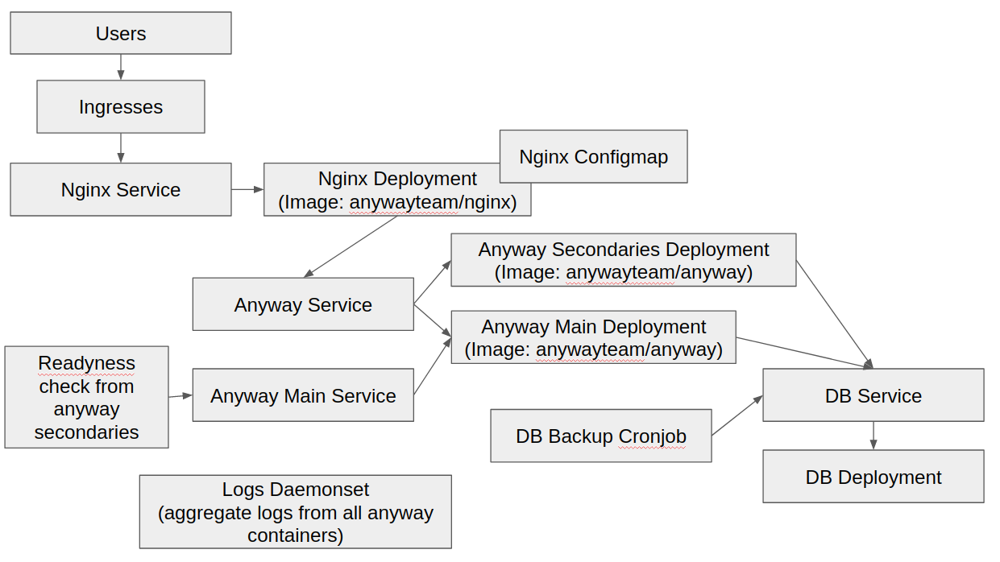

# Anyway

## Architecture

https://docs.google.com/presentation/d/1bXkcCgsXUr1FQA7hCZdb5_m7IXIiP1UixuOHuV88sfs/edit?usp=sharing



## Connect to the cluster

### Using Minikube for local testing

* [Install and start a Minikube cluster](https://kubernetes.io/docs/tasks/tools/install-minikube/)
  * When you start the cluster add this argument to set the right Kubernetes version `--kubernetes-version v1.16.7`:
  * Also, recommended to limit resources for the cluster:  `--memory 2048 --cpus 2 --disk-size 15g`
* Switch to the anyway-minikube environment
  * `source switch_environment.sh anyway-minikube`
* Make sure you are connected to your local minikube environment
  * `kubectl get nodes`
  * Should see a single `minikube` node
* Create the anyway-minikube namespace
  * `kubectl create ns anyway-minikube`

### Connecting to the production environment

```
export KUBECONFIG=/path/to/kamatera/kubeconfig
source switch_environment.sh anyway
```

## Initial Deployment

* Install the helm client
  * To make sure you get corret version you should use the script in this repo
  * `bash apps_travis_script.sh install_helm`
  * if you have problems, refer to helm docs - [helm client](https://docs.helm.sh/using_helm/#installing-the-helm-client)
    * You should have helm 3 available in your path as `helm3`
* Verify helm version
  * `helm3 version`
* Create secrets
  * set env vars with the secret DB values
    * `POSTGRES_PASSWORD=`
    * `ANYWAY_PASSWORD=`
    * `DBRESTORE_AWS_ACCESS_KEY_ID=`
    * `DBRESTORE_AWS_SECRET_ACCESS_KEY=`
    * `DBDUMP_AWS_ACCESS_KEY_ID=`
    * `DBDUMP_AWS_SECRET_ACCESS_KEY=`
  * create the DB secrets:
    * `kubectl create secret generic anyway-db "--from-literal=DATABASE_URL=postgresql://anyway:${ANYWAY_PASSWORD}@db/anyway"`
    * `kubectl create secret generic db "--from-literal=DBRESTORE_SET_ANYWAY_PASSWORD=${ANYWAY_PASSWORD}" "--from-literal=POSTGRES_PASSWORD=${POSTGRES_PASSWORD}" "--from-literal=DBRESTORE_AWS_ACCESS_KEY_ID=${DBRESTORE_AWS_ACCESS_KEY_ID}" "--from-literal=DBRESTORE_AWS_SECRET_ACCESS_KEY=${DBRESTORE_AWS_SECRET_ACCESS_KEY}"`
    * `kubectl create secret generic db-backup "--from-literal=DBDUMP_AWS_ACCESS_KEY_ID=${DBDUMP_AWS_ACCESS_KEY_ID}" "--from-literal=DBDUMP_AWS_SECRET_ACCESS_KEY=${DBDUMP_AWS_SECRET_ACCESS_KEY}" "--from-literal=DBDUMP_PASSWORD=${POSTGRES_PASSWORD}"`
  * Create the anyway secret (see the anyway production docker-compose for available values, or leave it empty just for basic testing)
    * `kubectl create secret generic anyway`
* Dry run and debug the anyway chart installation
  * `./helm_upgrade_external_chart.sh anyway --install --debug --dry-run`
* Install the anyway chart
  * `./helm_upgrade_external_chart.sh anyway --install`

## Update Deployment

* Make sure you are connected to the right environment: `kubectl get nodes`
* Dry run: `./helm_upgrade_external_chart.sh anyway --debug --dry-run`
* Deploy: `./helm_upgrade_external_chart.sh anyway`

## Enable logging

Setup bindplane monitoring target with container logs filter `/var/log/containers/*anyway*.log`

Set the target values in a secret:

```
kubectl create secret generic bindplane-logs \
    --from-literal=COMPANY_ID= \
    --from-literal=SECRET_KEY= \
    --from-literal=TEMPLATE_ID=
```

Set enableLogs=true in the environment's values
